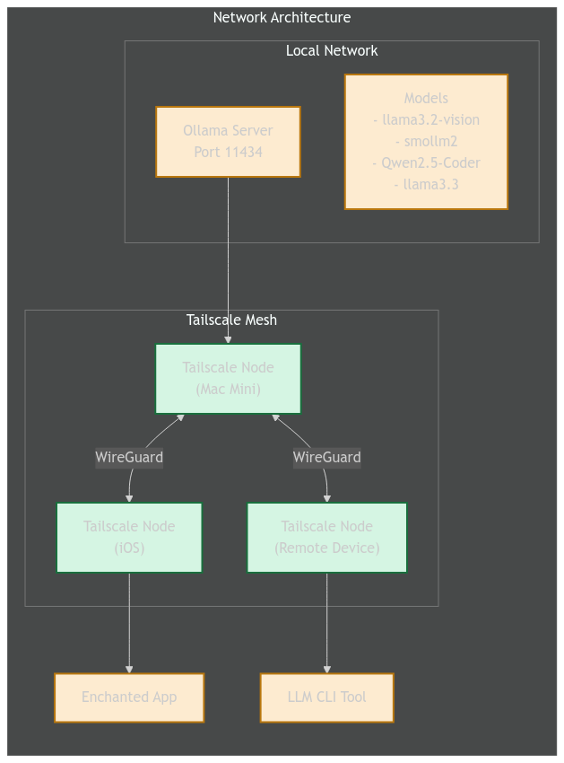

# Local LLM Setup Guide 

Local LLM Environment Setup Guide
=================================

In line with experimenting with LLMs locally, this guide details setting up a local lab environment. Using a new M4 Mini with 64 GB of unified memory enables running substantial models on the local network. To address remote access needs, the setup incorporates Tailscale for private networking via Wireguard, creating a private mesh that allows secure LLM access from anywhere without public internet exposure.  This guide describes how to set up a local LLM environment using a Mac Mini as the server, with both local and remote access capabilities.

### Physical Architecture

Physical setup showing Mac Mini M4 (64GB) connected to local network and devices

### Key Components:

*   **Ollama:** Running on Mac Mini to serve LLM models
*   **Tailscale:** For secure network connectivity
*   **LLM CLI:** Command-line interface for model interaction
*   **Enchanted:** iOS client for mobile access
*   **UV:** Python package and project manager, written in Rust

Prerequisites
-------------

### Hardware

Server
*   Mac Mini M4 with 64GB unified memory 1TB storage.

Clients:
*   iOS device for mobile access
*   Laptop

### Network

*   Stable internet connection
*   Administrator access on all devices
*   Local router with Ethernet/WiFi

Server Setup Instructions
-------------------------------
For the server I'm using an Mac Mini M4Pro with 64 gb of memory and 1 TB of storage running Mac OS Sequoia (macOS 15.2).

### 1\. Install Ollama on Mac Mini

Download and install Ollama from the official website:

    curl -fsSL https://ollama.com/install.sh | sh

or using brew

    brew install ollama

Verify installation:

    ollama --version

### 2\. Running LLM Models

Download your preferred models. For example:

    # Pull recommended models
    ollama pull llama3.2-vision:latest
    ollama pull smollm2:latest
    ollama pull phi4
    ollama pull llama3.3:latest

Set the server to listen on all ipaddresses
    user@host ~ % export OLLAMA_HOST=0.0.0.0
    user@host ~ % ollama serve

To run the server on startup you can use the brew command
    brew services start ollama

To set the host id you'll want to set the OLLAMA_HOST in launchctl. 
    launchctl setenv OLLAMA_HOST "0.0.0.0"

### 3\. Setup Tailscale

1.  Download Tailscale from [tailscale.com](https://tailscale.com/download)
2.  Install on Mac Mini, laptop and iOS device
3.  Sign in with your Tailscale account on all devices
4.  Note the Tailscale IP of your Mac Mini

## Clients

### Laptop
### 1\. Install [UV Package Manager](https://astral.sh/blog/uv)

Install UV using the official installation script:

    curl -LsSf https://astral.sh/uv/install.sh | sh

Verify installation:

    uv --version

### 2\. Run LLM CLI Tool with UV

To start I've been using the LLM cli from Simon Willison.  While I could do a full install, I've been trying out just using UV to run the client with minimal install.

Configure LLM with UV for Ollama access:

    # Set up alias for easy access
    alias oll='OLLAMA_HOST=http://[tailscale-ip]:11434 uvx --with llm --with llm-ollama llm '
    
    # Test the connection
    oll -m phi4 "Hello, world!"

### iPhone / iPad
### 3\. Setup Enchanted iOS App

1.  Download Enchanted from the App Store
2.  Open the app and go to Settings
3.  Add new server with your Tailscale IP
4.  Configure the endpoint: http://\[tailscale-ip\]:11434/api

### ⚠️ Important Security Notes

*   Ensure your Tailscale network is properly configured for security
*   Keep your Ollama installation updated
*   Regularly update your LLM models
*   Monitor system resources on your Mac Mini

Summary & Lessons Learned.
--------------------------

With this setup I can reach my private llm setup from anywhere on any device I choose to secure. Tailscale makes it easy to connect peer-to-peer wireguard connections for private networking allowing me to access self-hosted models without making them publically available or opening up my network attack surface. I can now grab and test new models as quickly as I can find them! The Mac Mini is tiny, quiet and sips power, at some point I may want to upgrade to a serious GPU system but for now it meets my needs very well (the Nvidia DIGITS announcement has caught my attention!) This setup makes it easy for me to understand the difference between different models by testing quickly.

Troubleshooting
---------------

🔍 Network Connectivity Issues

*   Verify Tailscale is running on both devices
*   Check Ollama service is running: `sudo lsof -i :11434`
*   Test connectivity: `ping [tailscale-ip]`
*   Verify no firewall blocking: `sudo lsof -i :11434`
*   By default MacOS will put the Mac Mini to sleep when not in use, make sure to change your energy settings to make sure the system is always available.
*   Make sure the Ollama server is listening on all ports, otherwise it may not look available via tailscale.

🔍 Model Loading Issues

*   Check model status: `ollama list`
*   Verify disk space: `df -h`
*   Check model pulling: `ollama pull [model] --verbose`

